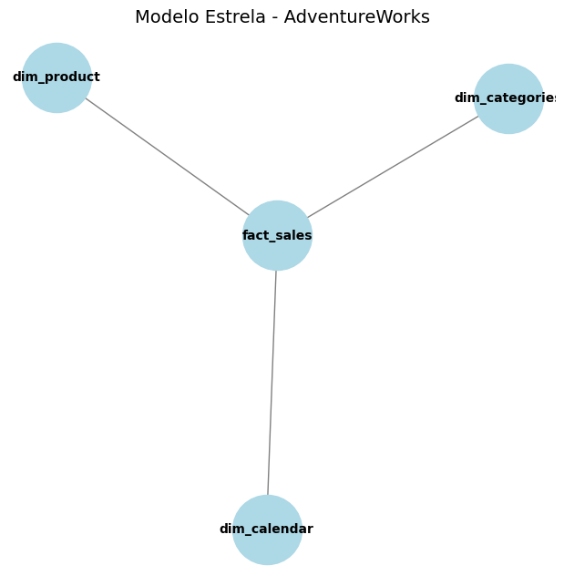

# Case Técnico Dadosfera — AdventureWorks 
**Maria Clara**

Bem-vindo ao Case Técnico Dadosfera   
Este projeto tem como objetivo demonstrar, de forma prática, as capacidades da plataforma Dadosfera
ao longo de todo o ciclo de dados — da ingestão à análise e consumo — utilizando como base o dataset
**Microsoft AdventureWorks**.

Este README serve como guia principal do projeto, apresentando os itens do case, o status de cada etapa
e os links para as evidências desenvolvidas.

---

## 🎯 Objetivo do Case

Demonstrar um fluxo **end-to-end de dados**, contemplando:

- Integração e organização dos dados
- Exploração, qualidade e governança
- Modelagem analítica
- Análises de negócio
- Uso de GenAI e Data Apps
- Observabilidade e organização na Dadosfera

---

## 🧭 Estrutura Geral do Projeto

- 📓 **Notebook (Colab):** Integração, exploração, qualidade, modelagem e análises  
- 🌐 **Dadosfera:** Governança, catálogo, GenAI, pipelines e observabilidade  
- 📊 **Streamlit:** Aplicação interativa para consumo dos dados analíticos  

---

# 📌 Execução do Case por Item

---

## Item 0 — Agilidade e Planejamento ✅

**Atividades realizadas:**
- Planejamento do projeto utilizando Kanban
- Definição das etapas, dependências e status das atividades

🔗 **Kanban Board:**  
<https://github.com/users/Mariacfagundes/projects/4>

📎 **Evidência:**  
Planejamento organizado por status: Backlog, Em andamento, Bloqueado e Concluído.

---

## Item 1 — Base de Dados ✅

**Atividades realizadas:**
- Pesquisa e seleção de uma base de dados para execução do case end-to-end
- Escolha da base **Microsoft AdventureWorks**

**Justificativa:**
A base AdventureWorks é amplamente utilizada em cenários analíticos e permite explorar
modelagem dimensional, métricas de negócio e análises temporais.

🔗 Documentação oficial:  
https://learn.microsoft.com/en-us/sql/samples/adventureworks-install-configure

---

## Item 2 — Dadosfera | Integrar ✅

**Atividades realizadas:**
- Upload dos arquivos da base AdventureWorks na plataforma Dadosfera
- Criação do dataset `casetecnico_mariaclara`
- Disponibilização das tabelas para exploração e análise

**Estratégia adotada:**
A integração inicial foi realizada de forma simplificada, priorizando agilidade no setup do case.
Em um cenário produtivo, essa ingestão poderia ser automatizada via S3 ou conexão com base transacional,
com aplicação de microtransformações na camada de ingestão.

📎 **Evidências:**
- Print do dataset na Dadosfera
- Print de algumas das tabelas carregadas

📎 **Evidência:**  

https://app.dadosfera.ai/pt-BR/collect/pipelines/aec2673c-8f97-47e8-ba72-f2dc18e898d8

<

https://app.dadosfera.ai/pt-BR/catalog/data-assets/3de32759-694d-47f6-8583-5906f511c379

<

https://app.dadosfera.ai/pt-BR/catalog/data-assets/23c16621-4138-4447-9f62-acbf1473fc17

>

---

## Item 3 — Dadosfera | Explorar ✅

**Atividades realizadas:**
- Catalogação das tabelas carregadas na plataforma Dadosfera
- Descrição funcional de cada dataset diretamente no catálogo
- Exploração inicial dos dados para entendimento de schema, tipos e granularidade
- Criação de dicionário de dados documentado no notebook do projeto

**Observações:**
- A descrição detalhada das colunas foi documentada externamente no notebook, servindo como dicionário de dados oficial do projeto
- A organização dos dados segue o conceito de Data Lake, documentado de forma conceitual

**Organização conceitual do Data Lake:**
- **Raw:** arquivos CSV originais, sem tratamento
- **Staging:** dados tratados, padronizados e com tipos ajustados
- **Analytics:** camada destinada à modelagem dimensional e consumo analítico

📎 **Evidências:**
- Print do catálogo de datasets na Dadosfera com descrições preenchidas
- Dicionário de dados disponível no notebook do projeto

https://app.dadosfera.ai/pt-BR/catalog/data-assets?pipeline_id=aec2673c-8f97-47e8-ba72-f2dc18e898d8&pipeline_name=casetecnico_mariaclara&tags=&asset_types=&page=1&sort=az

https://app.dadosfera.ai/pt-BR/catalog/data-assets/80e4a7dd-2120-4a47-bf8d-2eaadbad1b10

https://app.dadosfera.ai/pt-BR/catalog/data-assets/23c16621-4138-4447-9f62-acbf1473fc17

https://app.dadosfera.ai/pt-BR/catalog/data-assets/bc9a9d26-23d9-4d0c-af21-dbc7efbd034c

https://app.dadosfera.ai/pt-BR/catalog/data-assets/3de32759-694d-47f6-8583-5906f511c379

---

## Item 4 — Data Quality ✅

**Atividades realizadas:**
- Identificação de valores nulos e inconsistências
- Tratamento de tipos e padronização de colunas
- Registro das decisões de qualidade aplicadas

📎 **Relatório de Qualidade:**  
<!-- link markdown ou seção do notebook -->

🎯 **Resposta ao item 4:**  
Os principais problemas encontrados foram tratados na camada de staging.

---

## Item 5 – Sobre o uso de GenAI e LLMs (Processar) ✅

Nesta etapa, o objetivo foi demonstrar como dados estruturados podem ser preparados
para uso em aplicações de GenAI e LLMs, agregando valor ao negócio.

Foi realizada a criação de campos textuais enriquecidos a partir dos dados de produtos,
combinando informações como nome, categoria e preço em descrições prontas para uso
em prompts de modelos de linguagem.

Esse tipo de preparação permite casos de uso como:
- Geração automática de descrições de produtos
- Sistemas de recomendação baseados em texto
- Assistentes virtuais para apoio à decisão e experiência do cliente

A abordagem adotada demonstra como a plataforma de dados pode servir como base
para aplicações de IA, conectando dados estruturados a soluções de GenAI de forma simples
e escalável.

> Observação: esta etapa representa uma prova de conceito de como os dados tratados
> podem ser consumidos por LLMs em cenários reais de negócio, como e-commerce
> e análise de produtos.

---

## Item 6 — Modelagem de Dados ✅

Nesta etapa, os dados foram organizados em um **modelo dimensional no formato estrela**, seguindo os princípios da metodologia **Kimball**.

Foram criadas tabelas de **dimensão** e uma tabela de **fato**, com o objetivo de facilitar análises analíticas e consultas orientadas ao negócio.

### Dimensões criadas
- **dim_calendar**: dimensão de tempo, com atributos de ano, mês, trimestre e dia da semana.
- **dim_product**: dimensão de produtos, contendo informações como nome, cor, custo e preço.
- **dim_categories**: dimensão de categorias de produto.

### Tabela fato
- **fact_sales**: tabela central do modelo, contendo as principais métricas de negócio:
  - `order_quantity`
  - `revenue`
  - `margin`
  - `profit`

A tabela fato se conecta às dimensões por meio das chaves, permitindo análises por tempo, produto e categoria de forma eficiente.

### Diagrama do Modelo Estrela

O diagrama abaixo ilustra a estrutura do modelo dimensional desenvolvido, destacando a tabela fato no centro e suas conexões com as dimensões.

> Figura 1 – Modelo dimensional em estrela aplicado ao dataset AdventureWorks.

---

## Item 7 — Análise de Dados — Analisar ✅

Com os dados já integrados e estruturados na plataforma Dadosfera, foram criadas análises para gerar valor de negócio por meio de visualizações interativas.

### Dashboard – Análise Comercial AdventureWorks

O dashboard contempla as seguintes análises:

1. **Top 10 Produtos por Quantidade Vendida**  
   Identificação dos produtos com maior volume de vendas.

2. **Quantidade Vendida por Território**  
   Análise da distribuição das vendas por região.

3. **Distribuição de Produtos por Categoria**  
   Visão da participação de cada categoria no portfólio.

4. **Custo Médio vs Preço Médio por Produto**  
   Comparação entre custo e preço médio, apoiando análises de margem.

5. **Quantidade Média de Itens por Pedido**  
   Indicador operacional para entendimento do comportamento dos pedidos.

As análises foram desenvolvidas no módulo de Visualização da Dadosfera (Metabase), utilizando os datasets integrados na plataforma.

## Item 7 – Análise de Dados (Dadosfera)

### Coleção Criada na Dadosfera

### Análise Geral dos Dados

### Distribuição de Produtos por Categoria

### Query SQL Utilizada na Análise

---

## Item 8 — Pipelines ✅

Uma das etapas essenciais de um projeto de Dados é a criação de **Pipelines de Dados**.  
Aqui foi desenvolvido um pipeline simples e impactante, dividido em três camadas:

- **RAW**: carga inicial dos dados originais (Calendar, Products, Categories, Sales).  
- **STAGING**: limpeza e transformação dos dados (remoção de nulos, cálculo de margem de lucro, integração de produtos com categorias).  
- **ANALYTICS**: preparação para análise (dataset de vendas por categoria, normalização de preços para uso em Machine Learning).  

📌 **Sugestões de análises implementadas**:
- ETL de qualidade dos dados.  
- Pipeline de modelagem inicial (normalização de preços).  
- Dataset analítico pronto para consumo em Data Apps.  

---

## Item 9 — Data Apps ✅

Este projeto corresponde ao Item 9 da atividade sobre **Data Apps**, utilizando a biblioteca **Streamlit** para explorar os dados de vendas do dataset AdventureWorks.

---

## 🚀 Deploy do Aplicativo

O Data App está publicado no Streamlit Community Cloud e pode ser acessado no link:

🔗 https://mariasilvaddftech012026-psxut5o7wakcay2mhoyygr.streamlit.app/

---

## 📁 Dados Utilizados

Foram utilizados os seguintes arquivos CSV:

- fact_sales.csv
- dim_product.csv
- dim_categories.csv
- dim_calendar.csv

A aplicação faz a leitura e exibe a estrutura de cada tabela.

---

## 🔗 Modelagem / Integração

As tabelas são unidas seguindo um padrão de **Star Schema**, conectando:

- Fato: `fact_sales`
- Dimensões: `dim_product`, `dim_categories`, `dim_calendar`

---

## 📈 Funcionalidades do Data App

No acesso via browser, o Data App permite:

✔ Visualizar a estrutura das tabelas  
✔ Unir os dados (join) entre fato e dimensões  
✔ Exibir métricas gerais:  
  - Receita total  
  - Lucro total  
  - Margem média  
✔ Filtrar por ano  
✔ Visualizar gráficos:  
  - Top produtos por receita  
  - Receita ao longo do tempo

---

## 🛠 Tecnologias Utilizadas

- Python
- Streamlit
- Pandas
- Matplotlib / Plotly

---

## 🎯 Observação sobre o Item 9

O objetivo desta etapa foi demonstrar a criação de um **Data App funcional** e publicado, com capacidade de exploração visual de dados.

---

---

## Item 10 — Apresentação do Case ✅

**Planejado:**
- Gravação da apresentação do case
- Upload no YouTube
- Demonstração da solução end-to-end

---

# 🎨 Item Bônus – GenAI + Data Apps ✅

Este repositório contém a prova de conceito de integração entre **GenAI** e os dados do case AdventureWorks.  
O objetivo é demonstrar como a **Dadosfera** pode enriquecer aplicações analíticas com geração de conteúdo visual e textual.

---

## 🚀 Funcionalidades

- Integração com **OpenAI (DALL·E)** para gerar imagens de produtos a partir de prompts.  
- Documentação dos **prompts utilizados** para rastreabilidade.  
- Possibilidade de incorporar imagens geradas em **Data Apps** e apresentações.  

---

## 📑 Documentação de Prompts

| Produto   | Prompt                                                                 | Resultado esperado |
|-----------|-------------------------------------------------------------------------|--------------------|
| Bicicleta | "Crie uma imagem de uma bicicleta vermelha esportiva moderna, com design futurista" | Imagem gerada via DALL·E |
| Notebook  | "Crie uma imagem de um notebook preto minimalista em uma mesa de escritório moderna" | Imagem gerada via DALL·E |

---

## ⚠️ Observação

A execução real da API depende de **créditos ativos na OpenAI**.  
Neste ambiente, o código pode retornar erros de autenticação ou billing, mas o objetivo é **demonstrar a integração** e **documentar os prompts**.

---

## 📂 Estrutura

- `bonus_genai.ipynb` → notebook com código de integração e documentação dos prompts.  
- `README.md` → documentação do Item Bônus.  

---

## ✅ Conclusão

O Item Bônus mostra que a **Dadosfera** pode ir além do pipeline e dos Data Apps, integrando **IA generativa** para criar experiências mais ricas e visuais.  
Mesmo sem execução real, o código e os prompts provam a capacidade de integração com GenAI.

## 🚀 Considerações Finais

Este projeto demonstra a aplicação prática da plataforma Dadosfera como solução central
para governança, análise, observabilidade e consumo de dados, evidenciando um fluxo completo
de dados alinhado a boas práticas de engenharia e analytics.
